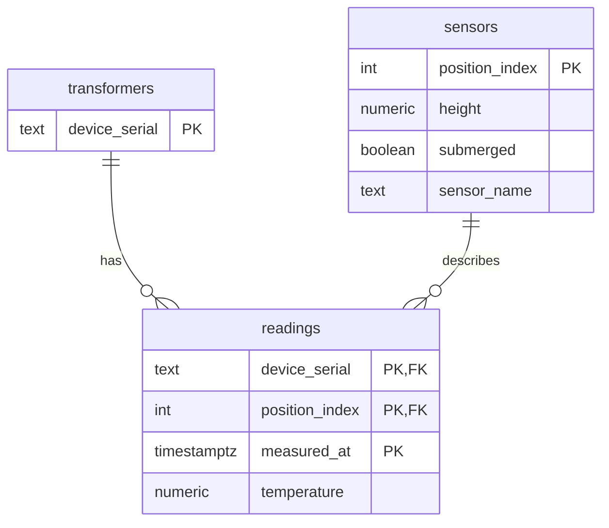

# Vertical Temperature Gradient Analysis in SQL

A PostgreSQL pipeline that models raw transformer thermistor telemetry and quantifies the vertical temperature gradient in the oil. It ingests raw JSON, transforms it into a clean relational model, runs analytical queries against that model and exports a resampled dataset for downstream analysis.

A companion [pandas analysis](https://github.com/stephengilbert1/thermal-gradient-analysis) covers the same data with statistical exploration and plotting. This project is the SQL side of that work: ingestion, modelling, the heavy set-based reduction and the handoff.

## Schema

Three modelled tables. `transformers` is the spine. `sensors` is a position to height lookup with a submerged flag. `readings` is the fact table, one row per sensor per timestamp, keyed on all three of its identifying columns and referencing the other two.



A fourth table, `staging`, holds the raw JSON on the way in. It is left out of the diagram because it carries no relationships. It exists only so the raw data lands untouched before SQL transforms it into the model above.

## The finding

Oil temperature increases steadily from the bottom of the tank to the top across all four transformers. This is consistent with normal convective circulation. The size of the increase varies by transformer from roughly 1.1 to 1.7°C per inch of oil.

The gradient figures match the companion pandas analysis which confirms the model and the transform are correct.

## The data

Four transformers (0002180, 0002181, 0002184, 0002190), Jan-Jun 2026. Each has 16 thermistors, TX_00 at the bottom of the oil volume to TX_15 at the top, spaced 0.25" apart, logged as JSON. Roughly 924,000 readings which explode to 14.8 million positioned rows once each 16-element array is unpacked.

Raw data is excluded from this repository due to confidentiality. The schema, loader and queries are shown in full. The pipeline is reproducible against equivalent data.

## Layering

The project follows a staging then model then analysis structure. Raw JSON lands untouched, SQL transforms it into the relational model and the analysis runs on that model. This is the same shape as a warehouse pipeline: land raw, model then serve.

1. **Schema** (`sql/01_schema.sql`). The staging table for raw JSON then the three modelled tables.
2. **Ingest** (`scripts/load.sh`). Finds every source file, reshapes each pretty-printed JSON array into one object per line with `jq` and streams it into staging with `COPY`.
3. **Transform** (`sql/02_load.sql`). Explodes each JSON temperature array into 16 positioned rows using `jsonb_array_elements WITH ORDINALITY`, converts the epoch timestamp, applies the 0002181 correction and populates the model.
4. **Analysis** (`sql/03_analysis/`). Reduction queries against the modelled tables. Each collapses the 14.8 million rows down to a small readable result.
   - `01_gradient_validation.sql` computes the per-transformer bottom-to-top gradient.
   - `02_vertical_profile.sql` is the mean temperature at each position per transformer. It shows the steady rise through the submerged thermistors then the flattening above the oil surface.
   - `03_coverage_and_gaps.sql` verifies coverage per transformer and flags gaps in the logging. It surfaces the known startup gap on 0002190.
5. **Export** (`sql/04_export.sql`). Resamples the readings to 15-minute intervals per transformer and position and writes the result to a CSV for the companion pandas analysis. See Handoff below.

## Validation

After the transform the model is checked with data quality assertions in `sql/tests/validation.sql`. Each check returns a PASS or FAIL row. They assert things the schema constraints cannot: that every staging object exploded to exactly 16 readings, that every timestamp carries a full sensor set, that positions run 0 to 15 and that temperatures sit within physically plausible bounds.

## Handoff

The export in step 5 is where this pipeline meets the companion pandas analysis. SQL does the heavy set-based work: ingestion, the 0002181 correction, modelling and resampling to 15-minute intervals. The result is written long, one row per transformer per interval per position, so pandas can pivot it, make the submerged-sensor cut and compute the error metric and correlations. All 16 positions are exported rather than pre-filtered to the submerged range, because which sensors sit in the oil is a conclusion the analysis reaches from the data rather than an input. The resampling interval is fixed at 15 minutes in the export.

The ambient and thermowell reference data is not yet in the model, so the current export is the thermistor side of the handoff only.

## Running it

Postgres runs in Docker so the whole thing is reproducible.

1. Copy `.env.example` to `.env` and set a password
2. `docker compose up -d` to start Postgres
3. `docker compose exec -T db psql -U your_user -d your_db -f /sql/01_schema.sql` to build the tables
4. `./scripts/load.sh` to ingest the raw data into staging
5. `docker compose exec -T db psql -U your_user -d your_db -f /sql/02_load.sql` to transform staging into the model
6. `docker compose exec -T db psql -U your_user -d your_db -f /sql/tests/validation.sql` to check the model
7. run the queries in `sql/03_analysis/`
8. `docker compose exec -T db psql -U your_user -d your_db -f /sql/04_export.sql` to write the resampled CSV to `exports/`

## Structure

```
docker-compose.yml     reproducible Postgres instance
.env.example           template for local credentials
sql/
  01_schema.sql        staging table plus the three modelled tables
  02_load.sql          transform staging into the model
  03_analysis/         reduction queries
  04_export.sql        resample and export for the pandas handoff
  tests/
    validation.sql     data quality checks run after the transform
scripts/
  load.sh              reshape and load the raw files into staging
data/                  raw JSON, excluded from the repo
exports/               generated CSVs, excluded from the repo
```

## Tools

PostgreSQL 18 in Docker. `jq` for the JSON reshape. Bash for the loader. That is the whole stack.

## Next

Error by depth using percentile functions. Bringing the ambient and thermowell reference data into the model. Handing the resampled export to Python for the statistical work and plotting that SQL is not suited to. A Makefile and a small synthetic dataset so the whole pipeline can be run from a clean clone without the confidential data.
